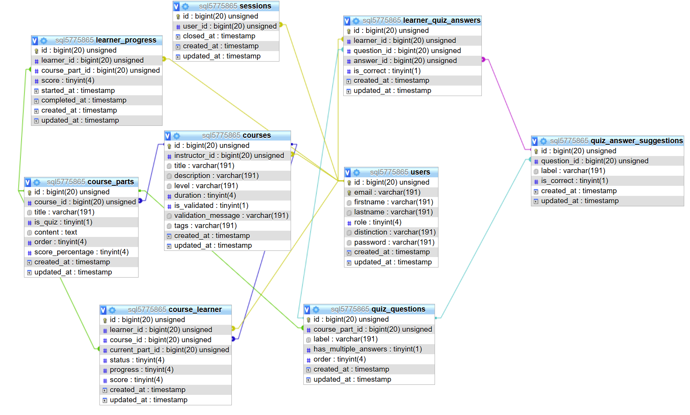
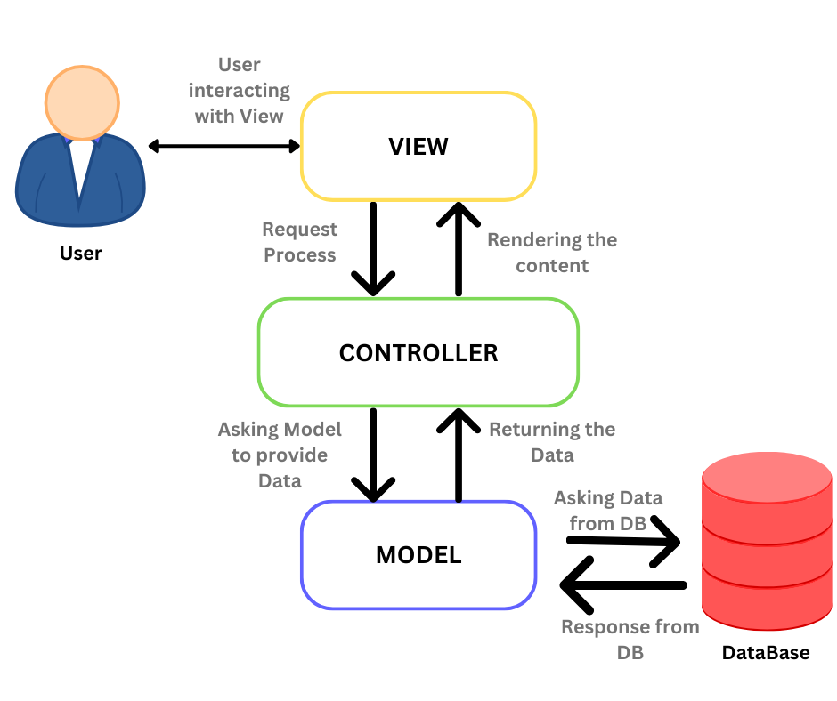
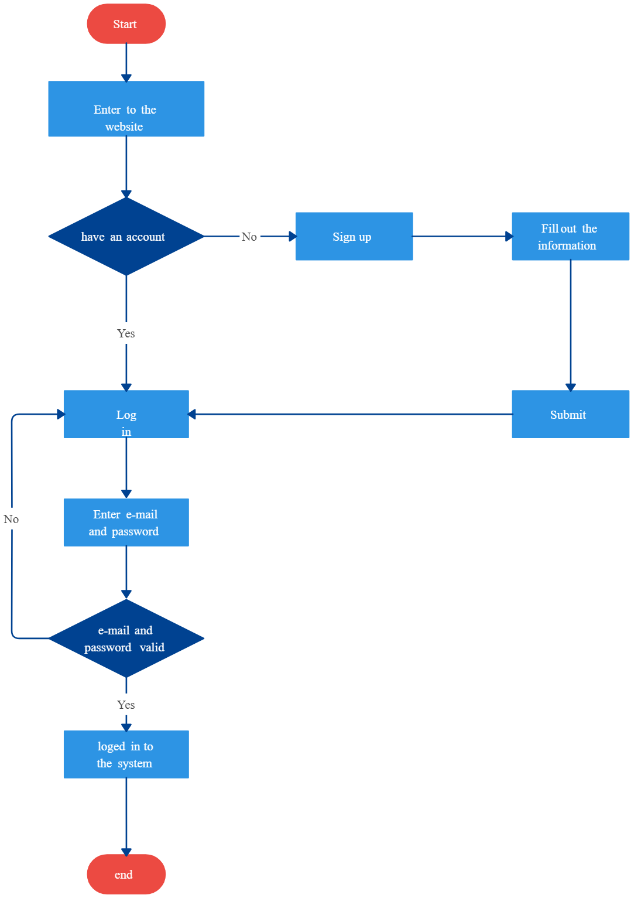
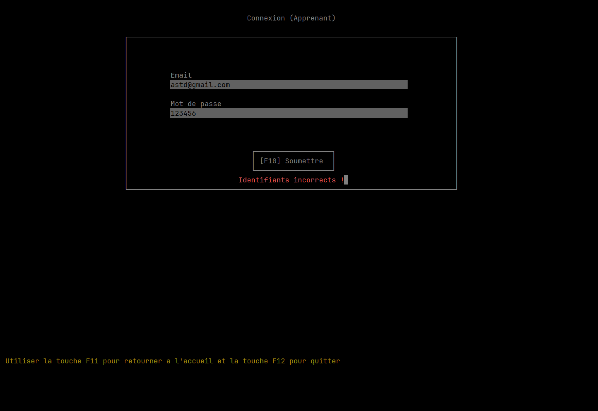
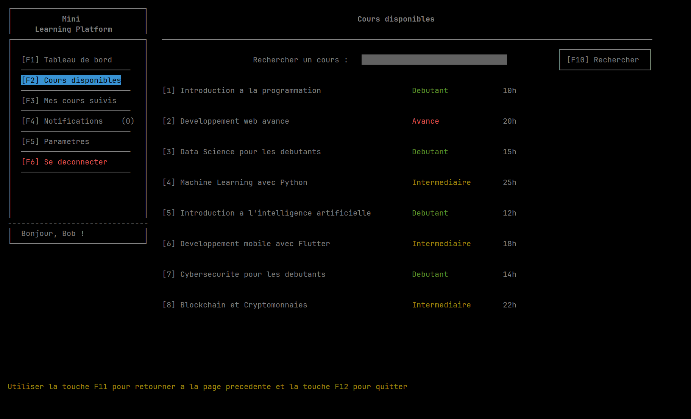
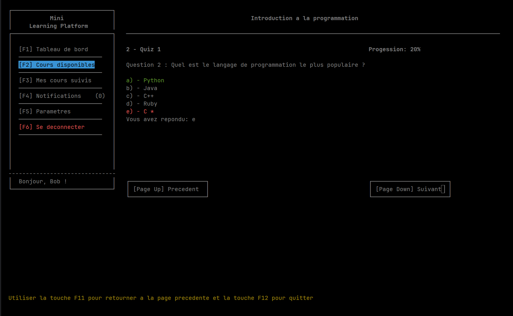

## Table de matières

- [Table de matières](#table-de-matières)
- [Introduction](#introduction)
- [Présentation du projet](#présentation-du-projet)
- [Conception et développement](#conception-et-développement)
- [Fonctionnalités réalisées](#fonctionnalités-réalisées)
- [Tests et validation](#tests-et-validation)
- [Comment exécuter le projet](#comment-exécuter-le-projet)
- [Notes importantes](#notes-importantes)
- [Conclusion](#conclusion)
- [Références](#références)


## Introduction

Ayant suivi le cours de résolution des problèmes d’ingénierie en C (GEI-1072),
il était question pour nous d’élaborer un projet de fin de session,
qui serait la vitrine des notions acquises durant la session d'hiver 2025.
A cet effet, nous nous sommes penchés sur la réalisation d’une plateforme d’apprentissage.
Ce projet vise à concevoir une plateforme intéractive qui s’appuie sur les bases du langage C
et dont le principal objectif est de proposer des leçons et des quiz via une interface console simple et efficace.
Le présent document a pour but de présenter le projet, sa conception, son développement,
ainsi que les tests effectués pour valider son bon fonctionnement.


## Présentation du projet

Dans les grandes lignes, voici comment se présente notre projet :
c'est une plateforme d'apprentissage qui permet aux utilisateurs de créer, de gérer ou de suivre des cours,
des leçons et des quiz.
On aura donc :
- **Des instructeurs** qui pourront créer des cours et des leçons, ainsi que des quiz.
- **Des apprenants** qui pourront s'inscrire à des cours et suivre les leçons.
- **Des administrateurs** qui pourront gérer les utilisateurs et valider les cours proposés par les instructeurs.  

Bien evidement, il y a un système d'authentification qui permet de s'assurer que seuls les utilisateurs autorisés
peuvent accéder à certaines fonctionnalités.


## Conception et développement

Dans cette section, nous allons présenter la conception et le développement de notre projet.
Ceci comprend la presentation d'un MLD (Modèle Logique de Données), d'une architecture de l'application,
d'un diagramme de flux et de l'explication de quelques fonctions essentielles du code.

### Modèle Logique de Données

Etant donné que ce cours n'est pas centré sur la conception,
nous n'allons pas nous attarder sur la conception de la base de données.
Nous avons opté pour un modèle relationnel simple qui nous permet de gérer les utilisateurs,
les cours, les leçons et les quiz.
Voici un aperçu de notre MLD :



Nous avons bâti les structures de notre application en nous basant sur le MLD ci-dessus.
Nous avons donc les entités suivantes :

- **User** : représente les utilisateurs de la plateforme (instructeurs, apprenants et administrateurs). Il contient les attributs suivants :
    - `id` : identifiant unique de l'utilisateur
    - `email` : adresse email de l'utilisateur
    - `firstname` : prénom de l'utilisateur
    - `lastname` : nom de l'utilisateur
    - `password` : mot de passe de l'utilisateur
    - `role` : rôle de l'utilisateur (instructeur, apprenant ou administrateur)
    - `distinction` : distinction de l'utilisateur (pour les instructeurs)
    - `created_at` : date de création de l'utilisateur
    - `updated_at` : date de mise à jour de l'utilisateur
  
- **Course** : représente les cours proposés sur la plateforme. Il contient les attributs suivants :
    - `id` : identifiant unique du cours
    - `title` : titre du cours
    - `description` : description du cours
    - `level` : niveau du cours (débutant, intermédiaire ou avancé)
    - `duration` : durée du cours (en heures)
    - `is_validated` : indique si le cours a été validé par un administrateur
    - `validation_message` : message de validation du cours (Ce champ contient le message émis par l'administrateur lors de la validation)
    - `instructor_id` : identifiant de l'instructeur qui a créé le cours
    - `created_at` : date de création du cours
    - `updated_at` : date de mise à jour du cours

- **CoursePart** : représente les parties d'un cours (leçons et quiz). Il contient les attributs suivants :
    - `id` : identifiant unique de la partie de cours
    - `title` : titre de la partie de cours
    - `is_quiz` : indique si la partie de cours est un quiz
    - `content` : contenu de la partie de cours (texte, si c'est une leçon)
    - `score_percentage` : pourcentage de la partie de cours (si c'est un quiz) sur le total
    - `course_id` : identifiant du cours auquel appartient la partie de cours
    - `created_at` : date de création de la partie de cours
    - `updated_at` : date de mise à jour de la partie de cours

- **QuizQuestion** : représente les questions d'un quiz. Il contient les attributs suivants :
    - `id` : identifiant unique de la question
    - `label` : libellé de la question
    - `has_multiple_choice` : indique si la question est à choix multiples
    - `order` : ordre de la question dans le quiz
    - `course_part_id` : identifiant de la partie de cours à laquelle appartient la question
    - `created_at` : date de création de la question
    - `updated_at` : date de mise à jour de la question

- **QuizAnswerSuggestion** : représente les suggestions de réponses d'une question. Il contient les attributs suivants :
    - `id` : identifiant unique de la suggestion de réponse
    - `label` : libellé de la suggestion de réponse
    - `is_correct` : indique si la suggestion de réponse est correcte
    - `question_id` : identifiant de la question à laquelle appartient la suggestion de réponse
    - `created_at` : date de création de la suggestion de réponse
    - `updated_at` : date de mise à jour de la suggestion de réponse

Les autres entités ne sont pas très intéressantes à présenter, nous allons donc nous arrêter là.

### Architecture de l'application
L'architecture de notre application est assez simple. En effet, elle repose sur un pattern MVC (Modèle-Vue-Contrôleur).
Le **modèle** est constitué des structures de données que nous avons présentées ci-dessus. Il inclut également les fonctions
qui permettent d'interagir avec la base de données (CRUD).  
La **vue** est constituée de l'interface console qui permet aux utilisateurs d'interagir avec la plateforme.
Le **contrôleur** est constitué des fonctions qui gèrent la logique de l'application et qui appellent les fonctions du modèle
pour interagir avec la base de données.  

La figure ci-dessous résume cette architecture :


### Diagramme de flux

Pour ne pas alourdir le document, nous n'allons pas présenter tous les diagrammes de flux de l'application. Nous allons
nous concentrer sur le diagramme de flux d'authentification.

Le processus d'authentification est assez simple. Il se déroule en plusieurs étapes :
- L'utilisateur ouvre l'application et choisit de se connecter ou de s'inscrire.
   - S'il choisit de se connecter, il doit entrer son adresse email et son mot de passe.
     - s'il entre des identifiants valides, il est redirigé vers le menu principal de l'application, selon son rôle.
     - s'il entre des identifiants invalides, il est invité à réessayer.
     - S'il choisit de s'inscrire, il doit entrer son adresse email, son prénom, son nom et son mot de passe.
       - s'il entre des informations valides, il est redirigé vers le menu principal de l'application, selon son rôle.
       - s'il entre des informations invalides, il est invité à réessayer.

Le diagramme de flux ci-dessous résume ce processus :


### Structures de fichiers
Voici la structure de fichiers de notre projet :
```
mini_learning_platform/
├── assets/ # Dossier contenant les ressources (images, etc.)
├── bin/ # Dossier contenant les fichiers binaires
├── controlers/ # Dossier contenant les contrôleurs
├── models/ # Dossier contenant les modèles
├── routes/ # Dossier contenant les routes
├── utils/ # Dossier contenant les utilitaires
│   ├── database/ # Dossier contenant les fichiers utiles a la communication avec la base de données
│   ├── curses/ # Dossier contenant les fichiers utiles a l'interface console
│   └── enums/ # Dossier contenant les fichiers d'enumérations
│   └── functions/ # Dossier contenant les fichiers de fonctions utilitaires
│   └── logs/ # Dossier contenant les fichiers de logs
│   └── session-handler/ # Dossier contenant les fichiers de gestion de session
├── views/ # Dossier contenant les vues
├── .gitignore # Fichier gitignore
├── Makefile # Fichier de compilation
├── README.md # Fichier de documentation
└── main.c # Fichier principal
└── app.log # Fichier de log
```

### Fonctions essentielles

Dans cette section, nous allons présenter quelques fonctions essentielles de notre application.

Nous commencerons par la fonction `setup_fields` qui permet de configurer les champs d'un formulaire ncurses.

```
FIELD** setup_fields(FieldProps *fields_props, int num_fields)
{
    FIELD **tmp = malloc((num_fields + 1) * sizeof(FIELD*));
    for (int i = 0; i < num_fields; i++)
    {
        int labelWidth = 0;
        if (fields_props[i].inlined_label)
        {
            labelWidth = (int) strlen(fields_props[i].label)+1;
        }

        tmp[i] = new_field(fields_props[i].height, fields_props[i].width, fields_props[i].starty, labelWidth + fields_props[i].startx, 0, 0);
        set_field_back(tmp[i], COLOR_PAIR(6)); // Set the background color
        field_opts_off(tmp[i], O_AUTOSKIP); // Don't go to next field when this field is filled up
        set_field_buffer(tmp[i], 1, fields_props[i].label);
    }
    tmp[num_fields] = NULL;

    return tmp;

}
```

Cette fonction permet de configurer les champs d'un formulaire ncurses. Elle prend en paramètre un tableau de `FieldProps`
qui contient les propriétés des champs (hauteur, largeur, position, etc.) et le nombre de champs. Elle retourne un tableau de pointeurs vers des champs ncurses.

Nous avons également la fonction `add_fetched_course_to_list` qui permet d'ajouter un cours récupéré de la base de données à la liste des cours.


```
void add_fetched_course_to_list(MYSQL_ROW courseRow, MYSQL_FIELD *fields, int num_fields, void **course_list_ptr) {
    Course *course = convert_mysql_fetched_row_to_course(courseRow, fields, num_fields);
    course->next = NULL;
    course->prev = NULL;

    CourseList **list_ptr = (CourseList **)course_list_ptr;

    if (*list_ptr == NULL) {
        *list_ptr = calloc(1, sizeof(CourseList));
    }

    CourseList *list = *list_ptr;

    if (list->head == NULL) {
        list->head = course;
        list->count = 1;
    } else {
        Course *p = list->head;

        while (p->next) p = p->next;

        course->prev = p;
        p->next = course;
        list->count++;
    }

    log_message("Added course: %s %d", course->title, list->count);
}
```

Cette fonction permet d'ajouter un cours récupéré de la base de données à la liste des cours. Elle prend en paramètre
une ligne de résultat de la requête SQL, les champs de la table et un pointeur vers la liste des cours (liste doublement chaînée).
Elle convertit la ligne de résultat en un objet `Course` et l'ajoute à la liste des cours.

Enfin, nous avons la fonction `log_message` qui permet d'enregistrer un message dans le fichier de log.

```
void log_message(const char *format, ...) {
#ifdef LOGGER_ENABLED
  FILE *log_file = fopen("app.log", "a");

  if (!log_file) {
    fprintf(stderr, "Unable to open log file !\n");
    return;
  }

  // Message horodating
  time_t now = time(NULL);
  struct tm *t = localtime(&now);
  fprintf(log_file, "[%04d-%02d-%02d %02d:%02d:%02d] ",
          t->tm_year + 1900, t->tm_mon + 1, t->tm_mday,
          t->tm_hour, t->tm_min, t->tm_sec);

  // Message formating
  va_list args;
  va_start(args, format);
  vfprintf(log_file, format, args);
  va_end(args);

  fprintf(log_file, "\n");
  fclose(log_file);
#endif

}
```

Ces fonctions sont essentielles pour le bon fonctionnement de notre application. En plus elles nous ont permis de manipuler
différents concepts de la programmation en C, tels que les pointeurs, les structures de données et la gestion des fichiers.


## Fonctionnalités réalisées

Le projet étant assez vaste, nous n'avons pas pu réaliser toutes les fonctionnalités prévues.
Nous avons donc choisi de nous concentrer sur les fonctionnalités suivantes :
- **Authentification** : Permet aux utilisateurs de se connecter ou de s'inscrire sur la plateforme.
- **Liste des cours** : Permet aux apprenants de consulter la liste des cours disponibles sur la plateforme.
- **Suivi des cours** : Permet aux apprenants de suivre des cours et de consulter les leçons et les quiz associés.
- **Création de cours** : Permet aux instructeurs de créer des cours et de les proposer à la validation.

Nous nous sommes concentrés sur ces fonctionnalités, car elles étaient les plus importantes pour la présentation de notre projet.

## Tests et validation

Pour valider notre application, nous avons effectué plusieurs tests unitaires et fonctionnels.
Les images ci-dessous montrent quelques exemples de tests effectués sur l'application.

- Test d'authentification :
  
  

- Test de liste des cours :

  

- Test de suivi des cours :



## Comment exécuter le projet

Pour exécuter le projet, il faut d'abord cloner le dépôt GitHub sur votre machine locale, si vous ne l'avez pas eu en format zip (depuis le portail de cours).
```
git clone https://github.com/Le-Topo/mini-learning-platform
cd mini-learning-platform
```

Ensuite, vous devrez vous rassurer d'avoir le fichier `db-credentials.h` dans le dossier `utils/database`.
Si vous ne l'avez pas, vous pouvez le créer en copiant le fichier `db-credentials.h.example` et en remplissant vos identifiants de base de données.
Dans le cas où vous n'avez pas de base de données, vous pouvez importer le fichier `db.sql` dans votre base de données MySQL.


Maintenant, il faudra installer les dépendances nécessaires au projet. Pour cela, il suffit de lancer la commande suivante :
```
make dependencies
```
Cette commande va installer toutes les dépendances nécessaires au projet.

Ensuite, vous pouvez compiler le projet en lançant la commande suivante :
```
make
```

Cette commande va compiler le projet et créer un exécutable dans le dossier `bin`.

Enfin, vous pouvez exécuter le projet en lançant la commande suivante :
```
cd bin && ./mini_learning_platform
```

Vous pouvez tester le programme en vous connectant avec les identifiants suivants :
- Instructeur :
  - email : john@doe.com
  - Mot de passe : 123456

- Apprenant :
  - email : bob@brown.com
  - Mot de passe : 123456

Ou vous pouvez créer un nouvel utilisateur en vous inscrivant avec votre adresse email et votre mot de passe.

## Notes importantes
- Les ordinateurs de l'école (connectés au réseau de l'école via Ethernet) ne permettent pas d'accéder à la base de données.
Il est alors impossible d'exécuter le projet sur ces ordinateurs. Il faut donc exécuter le projet sur un ordinateur personnel ou se connecter au réseau de l'école via WI-FI.  
Il semble que les ordinateurs de l'école soient configurés pour ne pas permettre l'accès à certaines ressources externes, ce qui empêche l'accès à la base de données.  

- Il faut agrandir le terminal ou le passer en plein écran pour que l'application fonctionne correctement. Car, une partie de l'interface peut ne pas s'afficher si le terminal est trop petit.

- L'application se sert de la touche `F11` pour retourner à une page précédente. Il faut donc s'assurer que
cette touche n'est pas utilisée par votre terminal ou votre système d'exploitation. Car, c'est le cas de `vscode` par exemple, qui utilise cette touche pour passer en mode plein écran.

## Conclusion
En conclusion, ce projet nous a permis de mettre en pratique les notions acquises durant le cours de résolution des
problèmes d’ingénierie en C (GEI-1072). Nous avons pu concevoir et développer une application fonctionnelle qui répond à un besoin réel.
Bien que nous n'ayons pas pu réaliser toutes les fonctionnalités prévues, nous avons pu nous concentrer sur les fonctionnalités essentielles,
à savoir l'authentification, la liste des cours, le suivi des cours et la création de cours. Nous pouvons donc dire que
le projet est un succès et qu'il nous a permis de maitriser des concepts clés de la programmation en C.

## Références
- [Documentation ncurses](https://tldp.org/HOWTO/NCURSES-Programming-HOWTO/)
- [Documentation MySQL C API](https://dev.mysql.com/doc/c-api/en/)
- [Documentation C](https://en.cppreference.com/w/c)
- [Documentation Git](https://git-scm.com/doc)
- [Documentation Makefile](https://www.gnu.org/software/make/manual/make.html)
- [ChatGPT](https://chat.openai.com/)
- [Flowchart for login process](https://creately.com/diagram/example/gy2h2rov2/flowchart-for-login-process)
- [The MVC architecture](https://medium.com/@sadikarahmantanisha/the-mvc-architecture-97d47e071eb2)